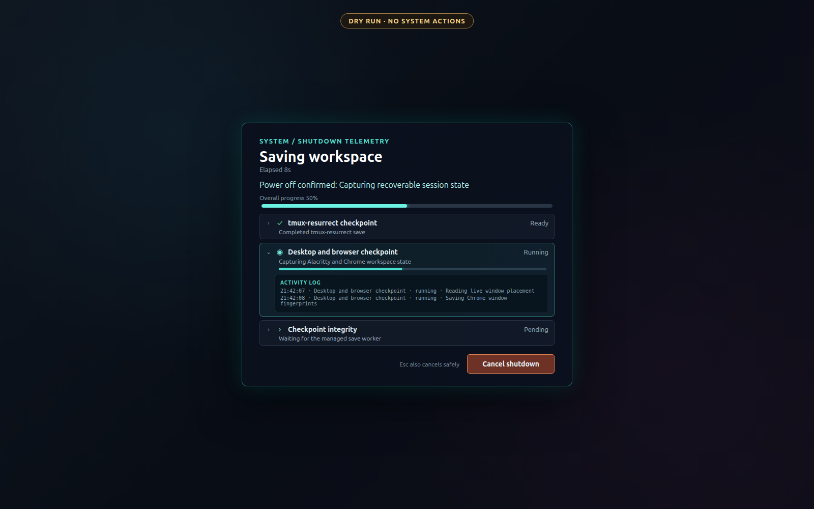

# Login HUD

[](https://github.com/Sage-Cat/login-hud/actions/workflows/ci.yml)



Login HUD is a borderless GNOME Shell overlay for visualizing ordered desktop
startup and pre-shutdown checkpoint work. Jobs have progress, state, expandable
substeps, and local activity logs. The repository contains the Shell UI and its
file protocol; the machine-specific state producer is deliberately separate.

The current release targets GNOME Shell 46 on native Wayland. The shutdown hook
uses GNOME Shell 46 internals and is therefore not advertised for other Shell
versions without a compatibility review.

## Safety model

- Startup is display-only and never takes a modal input grab.
- Shutdown work begins only after the final native **Power Off** or **Restart**
  confirmation.
- The extension intercepts shutdown only while the companion
  `wsctl-gnome-session.service` is active. If it is absent or unavailable, the
  original GNOME shutdown runs unchanged.
- A shutdown requires an operation-bound request, painted HUD acknowledgement,
  visible countdown, commit, and matching prepared marker.
- Cancellation is allowed until the final handoff. The protocol never manages
  GPU state, cloud mounts, or GNOME teardown.

`login-hud-v2@sagecat.local` is a GNOME Shell 46 extension that displays startup or shutdown telemetry. It is deliberately passive during login: before it receives a complete valid status document for the current GNOME Session Manager instance it stays hidden and does not register Shell chrome, stage listeners, or a refresh timer. The wsctl coordinator stores the kernel boot ID from `/proc/sys/kernel/random/boot_id` in private persistent state, so only the first GNOME session after an actual boot may publish `show_startup_hud: true`; same-boot re-logins restore in the background without creating HUD chrome. Tmux presence is deliberately not used as the trigger because tmux becomes active during a genuine first-boot restore. Once eligible status is present, the extension uses ordinary Shell chrome rather than top chrome, and only the bounded HUD panel participates in pointer input. Startup never acquires a modal or input grab, while its controls remain closable and expandable. An active shutdown alone uses GNOME's system-modal pointer and keyboard grab for **Cancel shutdown**. Invalid startup telemetry remains fail-open; an intercepted power-off or restart is deliberately fail-closed until the coordinator proves that preparation finished.

The extension watches this file (the directory is monitored so atomic rename writes are observed):

```
$XDG_RUNTIME_DIR/workspace-state/login-hud-status.json
```

## Status schema

Writers should write a complete replacement to a temporary file in the same directory, then atomically rename it to `login-hud-status.json`.

```json
{
  "schema_version": 1,
  "mode": "startup",
  "show_startup_hud": true,
  "session_id": "2026-09-01T08:24:12Z-1842",
  "started_at": "2026-09-01T08:24:12Z",
  "updated_at": "2026-09-01T08:24:17Z",
  "overall_state": "running",
  "overall_message": "Restoring desktop applications",
  "stages": [
    {
      "id": "shell",
      "label": "GNOME Shell ready",
      "state": "ready",
      "message": "Session handoff complete",
      "current": 1,
      "total": 1
    },
    {
      "id": "gdrive",
      "label": "Google Drive",
      "group_id": "cloud-drives",
      "group_label": "Cloud drives and metadata",
      "state": "running",
      "message": "Google Drive is connecting",
      "fraction": 0.4,
      "events": [
        {
          "at": "2026-09-01T08:24:17+03:00",
          "state": "running",
          "message": "Starting Google Drive"
        }
      ]
    }
  ],
  "error_log_path": "/run/user/1000/workspace-state/session-startup.log"
}
```

Required top-level fields are `schema_version` (currently `1`), `session_id`, `started_at`, `updated_at`, `overall_state`, `overall_message`, `stages`, and `error_log_path`. `mode` is optional and may be `startup` (the default) or `shutdown`. `show_startup_hud` defaults to `true`; wsctl sets it to `false` on later GNOME logins during an already-claimed OS boot. Shutdown documents also require a unique `operation_id`, `cancelled`, an explicit `shutdown_action` (`poweroff` or `restart`), and `shutdown_origin: "preflight"`. The extension displays a shutdown document only when its operation matches the private request created by the extension after native confirmation. It also validates `session_id` against the current GNOME Session Manager owner, so backend-only or stale status cannot flash or acquire a shutdown grab. `error_log_path` must be an absolute local path; it is only used when a failed stage or `overall_state: "failed"` is present.

Stage fields are `id`, `state`, `message`, and either `label` (the wsctl producer) or `name`. Progress can be supplied as optional numeric `current`/`total` counts or as `fraction` (clamped to 0–1). Supported states are `pending`, `waiting`, `running`, `ready`, `degraded`, `failed`, and `skipped`. A non-terminal stage without measurable progress displays an indeterminate spinner.

A terminal `degraded` shutdown is rendered as **ready with safe fallbacks**,
not as a failure. This means the producer retained a verified fallback for an
item it could not recapture exactly; expandable stage events explain which
fallback was used. A `failed` stage still stops handoff and exposes the full
error-log control.

Every displayed job is expandable by mouse or keyboard. Its `events` array is shown as a timestamped activity log; the wsctl producer keeps the last 32 distinct state/message transitions per stage. Stages with the same `group_id` are rendered as one aggregate job using `group_label`. Expanding that job shows each internal stage and a merged chronological log. Startup combines GNOME Wayland with display/workspace readiness, combines tmux-resurrect with Alacritty/tmux reconciliation, and combines `gdrive`, `nextcloud`, `pdrive`, and `warmup` as a single cloud-drive job. Shutdown contains the tmux checkpoint, desktop/browser checkpoint, dynamically configured pre-shutdown profile jobs, and checkpoint-integrity proof. It never stops cloud drives, warm-up services, or GNOME components; Ubuntu performs normal service teardown after the handoff.

The overview progress is derived from displayed jobs. A grouped job's progress is the average of its internal stages. A terminal stage without a fraction counts as complete; a non-terminal stage without one counts as not-yet-complete. Expanded content scrolls inside a bounded panel rather than growing beyond the screen.

In `startup` mode, when every stage is terminal (`ready`, `degraded`, `failed`, or `skipped`) and none failed, the HUD exposes **OK**. Pressing it records a private dismissal marker bound to the exact GNOME session and startup timestamp, so extension reloads cannot resurrect the completed HUD. Locking the screen or entering the greeter also dismisses a completed non-failing startup HUD; an unlock therefore never presents stale startup progress as a new login. A completed status older than five minutes is ignored if the extension is enabled later. Active restoration and failures are not automatically dismissed. Startup controls do not focus themselves or capture keyboard/pointer input; they can be clicked or reached normally from the bounded panel.

For an ordinary power-off or restart, GNOME first shows its stock confirmation. GNOME's early `QueryEndSession` is answered passively and cannot start a HUD or checkpoint. Only after the user presses the final **Power Off** or **Restart** button does the extension intercept the corresponding `_confirm` callback and retain the exact original signal. It waits until the native dialog is fully closed, writes a private `shutdown-request.json`, and then allows the coordinator to show the modal HUD and save tmux plus desktop/browser state. The extension never emits the retained signal merely because status says ready. It first waits for the ready HUD to be allocated and painted, writes `shutdown-hud-rendered.json`, displays a visible three-second countdown, writes `shutdown-commit.json`, and finally requires a matching `shutdown-prepared.json` before invoking GNOME's saved confirmation. If GNOME subsequently presents **Power Off Anyway** because another application inhibited logout, that confirmation continues the already prepared operation without starting another checkpoint.

The companion coordinator may also hold a logind block inhibitor while the
graphical session is active. The HUD protocol does not release it: only the
coordinator can do so after the matching painted/countdown/commit evidence has
been verified. Closing or cancelling the HUD therefore cannot accidentally
authorize an unprepared operating-system shutdown.

During shutdown, **Cancel shutdown** remains available until the final handoff and `Esc` invokes the same action. The extension atomically writes an operation-bound `shutdown-cancel.json`, stops only the managed preflight worker, and cancels GNOME's pending DBus dialog exactly once; retrying that cancellation could accidentally close a later, unrelated dialog. The backend uses the same operation ID to restore any profile job that changed application state, and reports that recovery before the transaction becomes terminal. A failed stage never commits or invokes the original action, keeps the HUD visible, and exposes **Show full error log** and **Close**. Disabling the extension during active preflight also cancels both sides. If no matching status arrives within 15 seconds, shutdown is safely cancelled instead of leaving an invisible pending transaction.

The special GNOME **Boot Options** restart remains on GNOME's native path
because it changes bootloader state before confirmation and therefore cannot
safely offer a reversible HUD preflight. Direct logind/systemd power commands
cannot create this Shell HUD; while the coordinator is active, its block
inhibitor prevents ordinary unprivileged calls from bypassing the protected
GNOME path. A privileged forced shutdown remains an explicit emergency
override.

A new `session_id`, startup timestamp, or a change between `startup` and `shutdown` resets an in-memory dismissal. Persisted startup dismissals must match both the session ID and startup timestamp. This lets a shutdown HUD reappear after its startup HUD was dismissed while preventing completed startup telemetry from returning after lock/unlock or an extension reload.

## Install and development

### Install a release bundle

Download both files from the matching GitHub release, verify the checksum, and
install the ZIP for the current user:

```sh
sha256sum --check login-hud-v2@sagecat.local.shell-extension.zip.sha256
gnome-extensions install --force login-hud-v2@sagecat.local.shell-extension.zip
gnome-extensions enable login-hud-v2@sagecat.local
```

Log out and back in once before relying on the newly installed code.

### Install from source

```sh
git clone https://github.com/Sage-Cat/login-hud.git
cd login-hud
npm ci
make check install
```

The install script copies only `metadata.json`, `extension.js`, and
`stylesheet.css` into the current user's GNOME extension directory and enables
the UUID when the running Shell already knows it. Log out and back in after a
new installation or upgrade; GNOME Wayland does not reliably reload changed
JavaScript modules in place.

To remove it:

```sh
make uninstall
```

The extension is safe without the companion service: it stays passive until a
valid status document exists, and native GNOME shutdown remains fail-open. To
use shutdown checkpointing, implement the documented runtime-file protocol and
run its coordinator as the active user unit `wsctl-gnome-session.service`.

### Build a release artifact

On Ubuntu 24.04, install `jq`, Node.js 20.19 or newer with npm, `shellcheck`,
`unzip`, and the GNOME extension CLI, then run:

```sh
npm ci
make release-artifacts
```

This creates a GNOME Shell extension ZIP and adjacent SHA-256 file under
`dist/`. `make package` verifies that the archive contains exactly the three
runtime files. Tagged GitHub releases run the same checks and attach both
artifacts automatically.

For development, disable and enable the extension after changing files:

```sh
gnome-extensions disable login-hud-v2@sagecat.local
make install
gnome-extensions enable login-hud-v2@sagecat.local
```

In-place disable/enable is useful for UI iteration, but a fresh GNOME Shell
login is the authoritative deployment test.

## Validation

`make check` validates `metadata.json`, parses `extension.js` as an ES module with Node's stdin module syntax checker, and runs the pinned ESLint toolchain. `tests/check.sh` additionally checks lifecycle and two-phase shutdown invariants: no chrome before valid status parsing, install-before-layout, safe allocation checks, coordinator fail-open, shutdown-only modal capture, durable request/paint/commit markers, prepared-marker matching, exact deferred GNOME handoff, cancellation, and wrapper restoration. Node is used only for static validation; the extension itself uses GNOME Shell GJS/GI APIs exclusively.

The latest local source/install verification and its explicit activation boundary are recorded in [`VERIFICATION.md`](VERIFICATION.md).

For an installed extension, inspect Shell's view of it with:

```sh
gnome-extensions info login-hud-v2@sagecat.local
```
