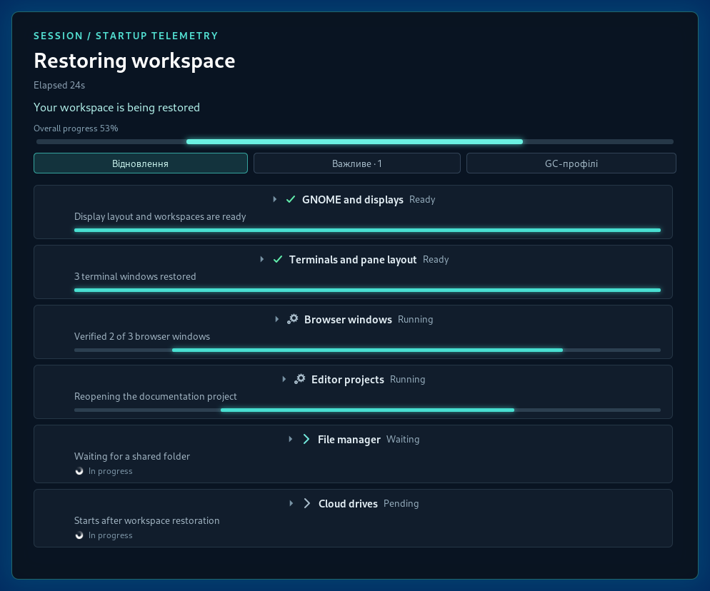

# Login HUD

[](https://github.com/Sage-Cat/login-hud/actions/workflows/ci.yml)

Login HUD shows desktop restoration progress and checkpoint preparation before
shutdown. It runs inside **GNOME Shell 46 on Wayland**. The companion coordinator
performs the work; the HUD presents progress, diagnostics, cancellation, and the
final shutdown confirmation handshake.



*Actual GNOME rendering in a disposable headless session. All displayed jobs and
reports are synthetic. [More screenshots and reproduction](docs/screenshots.md).*

## What it does

- **Startup:** shows ordered jobs, counts or progress, waiting states, and
  expandable activity. It never takes a modal input grab. The coordinator
  decides whether this login should display it; later logins in the same boot
  can restore quietly.
- **Important systems:** the **Важливе** tab shows active critical incidents from
  the companion's first-party inventory. Acknowledging an incident does not
  resolve it or hide an active problem.
- **Cleanup status:** **GC-профілі** displays profile outcomes from `gc-profiled`.
  It cannot start, stop, or enable cleanup.
- **Shutdown:** after GNOME's final Power Off or Restart confirmation, displays
  checkpoint jobs and Cancel. Handoff requires the same operation's completed
  status, a painted HUD, a visible countdown, and a matching prepared marker.
  A failed step blocks handoff and exposes its error log.

The extension does not restore application content, mount drives, collect
incidents, or implement cleanup policy. Those responsibilities remain with
[workspace-state](https://github.com/Sage-Cat/workspace-state) and
[gc-profiled](https://github.com/Sage-Cat/gc-profiled).

## Install

If workspace-state manages the desktop, use its
[coordinated release deployment](https://github.com/Sage-Cat/workspace-state/blob/main/docs/deployment.md)
so the HUD and coordinator activate together at the next login.

For a standalone installation, download `SHA256SUMS` and the extension ZIP from
[the latest release](https://github.com/Sage-Cat/login-hud/releases/latest):

```sh
sha256sum --check --ignore-missing SHA256SUMS
gnome-extensions install --force login-hud-v2@sagecat.local.shell-extension.zip
```

Log out and back in to load changed modules, then enable the extension if needed:

```sh
gnome-extensions enable login-hud-v2@sagecat.local
```

The UI stays hidden until a valid current-session report exists. Without the
active `wsctl-gnome-session.service` coordinator, native shutdown follows GNOME's
normal path. Installing this extension alone does not create a status producer.

## Documentation

- [Operation and troubleshooting](docs/operations.md): tabs, controls, upgrade
  checks, failures, cancellation, and safe diagnostics.
- [Architecture](docs/architecture.md): component boundaries and shutdown flow;
  includes [PlantUML source](docs/architecture.puml) and a rendered diagram.
- [File protocol](docs/protocol.md): status fields, operation identity, report
  sources, marker files, and producer requirements.
- [Screenshot gallery](docs/screenshots.md): real startup, details, alerts,
  cleanup, shutdown, and failure views with reproducible capture instructions.

## Build and validate

Use Node.js 20.19 or newer with npm, `jq`, `shellcheck`, `unzip`, and the
`gnome-extensions` CLI. On Ubuntu 24.04 the CLI is provided by `gnome-shell`.

```sh
npm ci
make check
make release-artifacts
```

`dist/` receives the extension ZIP and its adjacent `.sha256` file. The bundle
contains exactly `metadata.json`, `extension.js`, `buildInfo.js`, and
`stylesheet.css`. Checks cover parsing, lint, layout, reports, enable/disable
lifecycle, and shutdown authorization. Headless documentation capture is
separate and explicitly opt-in.

For development, `./scripts/install.sh --no-enable` copies those four files into
the user's extension directory without enabling the extension. A fresh GNOME
login is the reliable way to activate updated Wayland modules. `make uninstall`
removes the standalone installation; it does not remove coordinator data.

Successful canonical `master` pushes run CI and publish a `build-<full-SHA>`
release with source, the extension bundle, and checksums. A serialized job
promotes the current branch's release to Latest. The explicit `v<version>` tag
workflow remains available. See the
[publication contract](https://github.com/Sage-Cat/workspace-state/blob/main/docs/publication.md).
In a fresh clone, enable the local privacy gate with
`git config core.hooksPath .githooks`; CI repeats it before publication.
