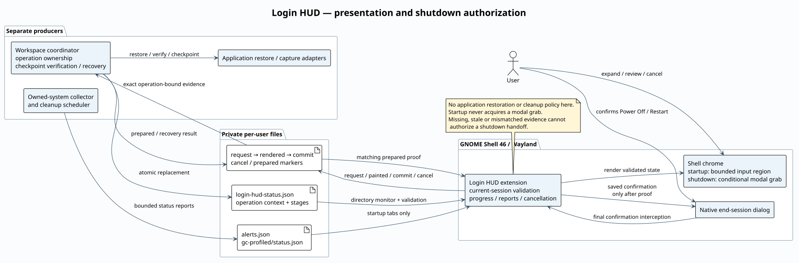

# Architecture

Login HUD is the presentation and final confirmation layer. Workspace-state owns
operation lifecycle, restoration, checkpoint verification, and recovery; the
cleanup scheduler and incident collector own their independent reports.



[Editable PlantUML source](architecture.puml). Regenerate with:

```sh
plantuml -tsvg -nometadata docs/architecture.puml
```

## Presentation boundary

The extension watches the private status directory, so atomic file replacement
is observed. It validates the document before installing visible Shell chrome.
An enable epoch and monotonically increasing load serial reject callbacks from
an old enable or superseded read. Current-session identity prevents an old
login's report from becoming current UI.

Startup uses ordinary Shell chrome. Only the panel participates in pointer
input; it does not acquire a modal grab. The primary monitor's usable area and
scale determine the panel budget. Header, notices, and actions reserve space;
only the job list scrolls. Stage grouping and progress normalization are pure
functions exercised by the Node unit tests.

Important-system and cleanup reports are independent inputs. They refresh their
views without opening a hidden HUD or overriding startup eligibility. The HUD
cannot turn a missing report into a healthy result. Cleanup reports are passive;
incident acknowledgment is a fixed validated command rather than content-supplied
shell execution.

## Shutdown transaction

The final native confirmation is retained only while the coordinator is active.
The extension writes a request and displays matching status for that operation.
Authorization carries immutable boot, login, operation, mode, attempt, and
monotonic-deadline identity.

Ready telemetry alone is insufficient. The extension acknowledges an allocated,
painted ready frame, keeps the five-second countdown visible, writes a commit,
then waits for the exact prepared marker. Only then does it invoke the saved
native confirmation. A second native confirmation caused by another inhibitor
continues the same prepared operation instead of starting a new checkpoint.

The coordinator drains verified application units after countdown commit and
before releasing its inhibitor, keeping the compositor available for native
application exit. Its 30-second drain budget fits within the HUD's bounded
35-second prepared-marker wait. Expiry withdraws handoff; it never substitutes
for a prepared marker.

Cancel withdraws local authorization before file I/O or backend recovery. Its
operation remains fenced even if a late ready message arrives. Disabling the
extension unwinds listeners and input capture and cancels active preparation.
The backend can separately hold a logind block inhibitor; the HUD itself cannot
release that inhibitor.

## Source map

| File | Responsibility |
| --- | --- |
| `extension.js` | GNOME lifecycle, file watches, operation ownership, shutdown interception, authorization, and read-only diagnostics. |
| `reports.js` | Pure status, alert, cleanup, normalization, aggregation, and presentation helpers. |
| `hudView.js` | `LoginHud` St.Widget presentation class and rendering callbacks. |
| `stylesheet.css` | Panel, rows, progress indicators, states, actions, and tabs. |
| `metadata.json` | UUID, supported Shell version, and extension version. |
| `buildInfo.js` | Import-time build identity stamped into release artifacts. |
| `tests/*.mjs` | Pure logic, layout, lifecycle, and operation-bound shutdown regressions. |
| `scripts/capture-docs.py`, `scripts/screenshot-fixture.js` | Opt-in disposable compositor and synthetic screenshot scenarios; excluded from the extension bundle. |

Shutdown status and native dialog actions share one operation binding. A stale
failure cannot replace a newer preflight or cancel its dialog; unbound historical
failures stay passive. Local withdrawal survives disable/re-enable even if the
cancellation file cannot be written.

The [file protocol](protocol.md) defines integration fields. Screenshots validate
actual rendering, while the unit tests exercise authorization and failure paths;
neither replaces a coordinated activation test on the target GNOME version.
The [testing guide](testing.md) records the unit, isolated Shell and genuine VM
shutdown coverage separately.
