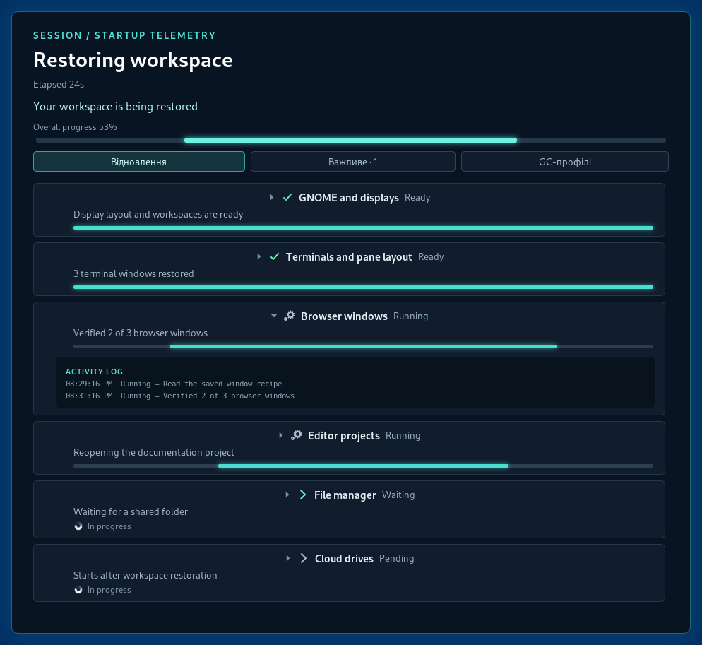
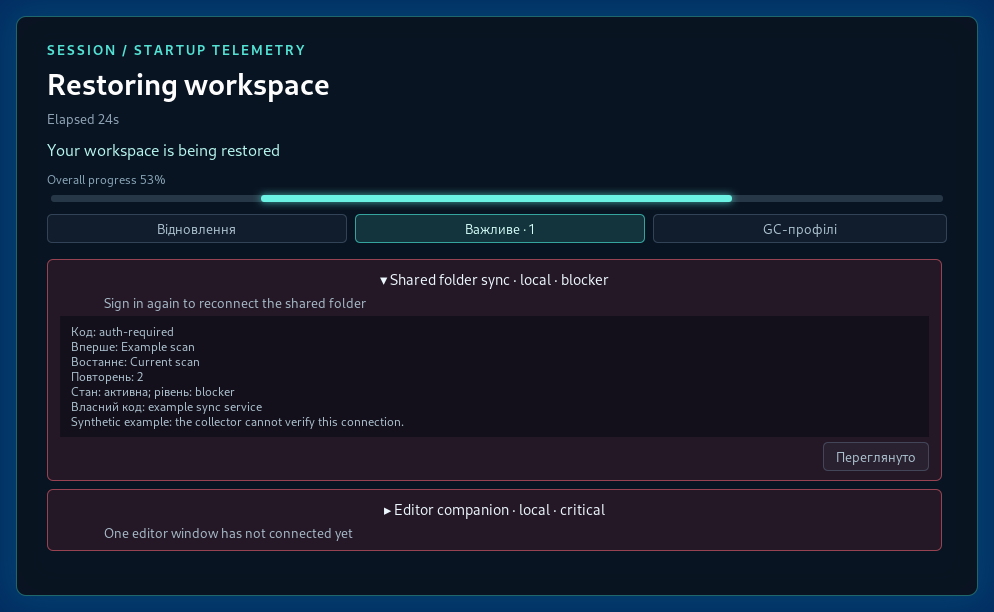
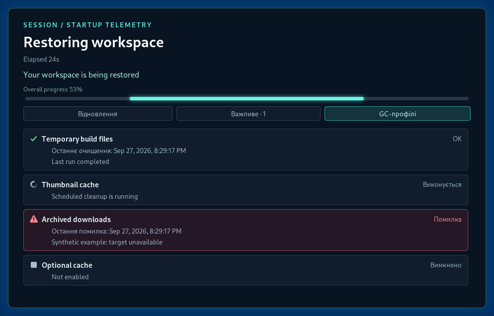
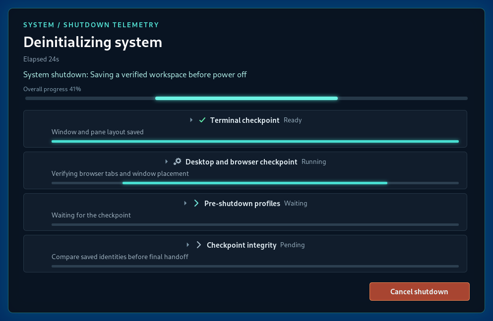
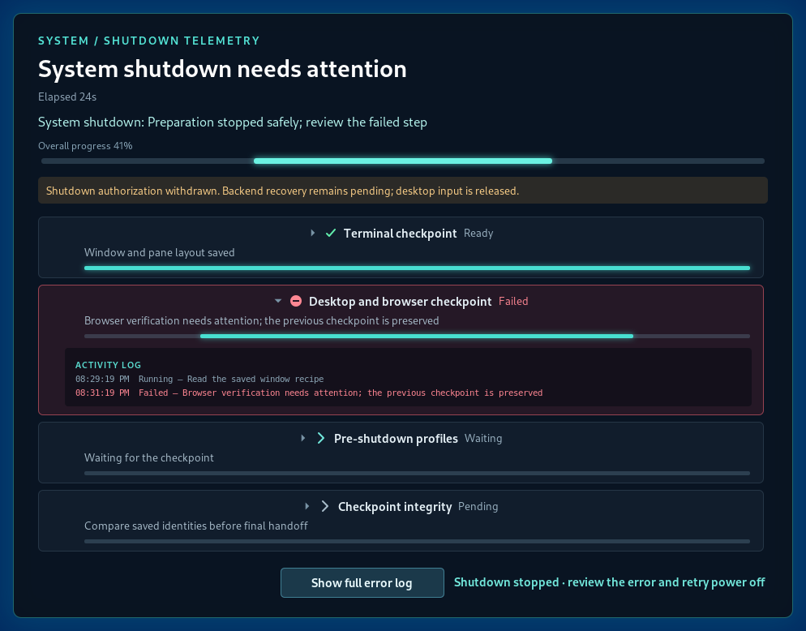

# Screenshot gallery and reproduction

These are native GNOME Shell 46.0 renders of the current extension, with synthetic
telemetry. They are not HTML mockups. Each image captures the HUD panel directly
through `Shell.Screenshot`; no image editing or compositing is applied.

## Startup restoration

Completed, running, waiting, and pending jobs remain distinct. Startup does not
acquire a modal grab.


## Expanded activity

An expanded browser job shows recent timestamped activity beneath its progress.



## Important-system incidents

The Important tab shows an unreviewed blocker with expanded safe details and a
second reviewed incident. Review does not resolve an active condition.



## Cleanup profiles

Success, running, failure, and disabled states are visible together. There are
no controls for enabling or running cleanup.



## Shutdown preparation

After native confirmation, matching synthetic shutdown telemetry shows saving
and verification work. The real modal grab and Cancel button are present in
this disposable compositor; no shutdown handoff is permitted by the fixture.



## Failure and attention

The failed browser verification exposes activity and the full-log control.
Authorization is withdrawn and input capture is released while recovery remains
unproven. The fixture creates no real checkpoint and opens no real log.



## Reproduce

Prerequisites: GNOME Shell 46 with its headless Wayland backend, Python 3,
`dbus-run-session`, `gdbus`, `glib-compile-schemas`, and Mesa software rendering.
The controller uses private extension internals for synthetic input and is not
an installed production interface.

From the repository root:

```sh
python3 scripts/capture-docs.py --run --output docs/images
```

The script preserves `HOME` and creates temporary XDG directories, in-memory
settings, a private session bus, and a software-rendered 1400×1100 virtual monitor. It copies
the four runtime extension files to that temporary tree, assigns a documentation
UUID, and loads a separate documentation controller. No production source is
patched, no coordinator or cleanup daemon is started, and no real application
profiles are read. External action callbacks are blocked, native shutdown
handoff throws, and only synthetic reports are published inside the temporary
runtime. All six scenes assert the expected modal state.

The private compositor and its bus are terminated after capture or timeout;
there is a 115-second outer bound. Only PNGs and [provenance.json](images/provenance.json)
are copied to the requested output directory. Provenance records Shell version,
extension version, source hashes, viewport, and scene/modality results without
private paths or real session identities. Relative elapsed times and the exact
rasterization may vary with capture timing and installed fonts.

To regenerate the architecture image independently:

```sh
plantuml -tsvg -nometadata docs/architecture.puml
```
